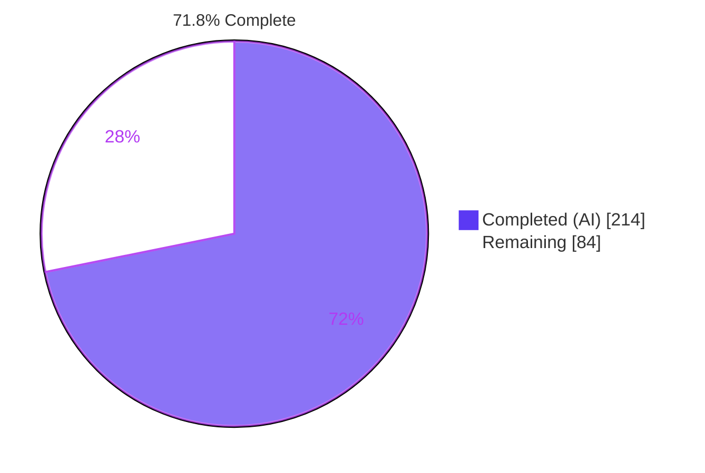
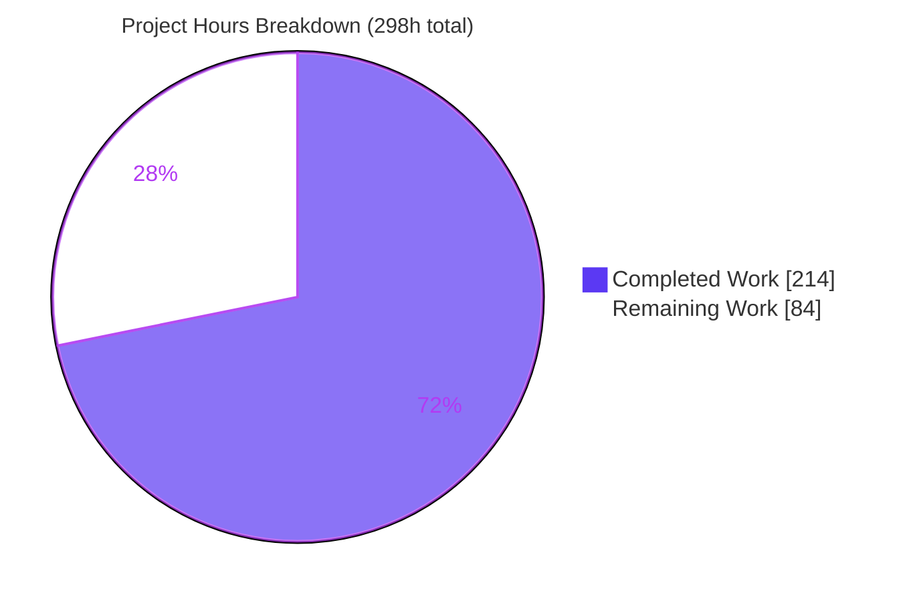
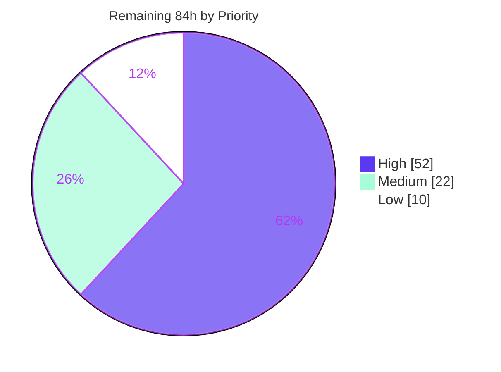

# Blitzy Project Guide — SENDGRID_BULK_UPLOAD Async Destination Connector

**Repository:** `rudder-server` (RudderStack) · **Branch:** `blitzy-edca8d36-edfa-4be9-b7c6-c0d5cbb916f0` · **HEAD:** `d77e9664c1b4438f6aefaba47f2b203dc3cfe3dd` · **Feature base:** `5bfc9c9e95ee21bf0f105e08868973b7237a5d37`

---

## 1. Executive Summary

### 1.1 Project Overview

This project adds `SENDGRID_BULK_UPLOAD`, a new asynchronous bulk-upload destination connector, to rudder-server's Batch Router. It delivers RudderStack `track` and `identify` events to Twilio SendGrid's Marketing Contacts API as upserted contacts, serving RudderStack customers who need marketing-contact synchronisation at batch scale. Technically it is a self-contained Go package satisfying the four-method `common.AsyncDestinationManager` contract — transform, chunked upload, import polling, and per-row reconciliation — wired in through three single-line registration edits. The change is strictly additive: no shared interface, framework file, or sibling connector is modified, and no new dependency is introduced.

### 1.2 Completion Status



> **Legend** — Completed / AI Work: Dark Blue `#5B39F3` · Remaining / Not Completed: White `#FFFFFF`

| Metric | Value |
|---|---|
| **Total Hours** | **298** |
| **Completed Hours (AI + Manual)** | **214** (AI 214 + Manual 0) |
| **Remaining Hours** | **84** |
| **Percent Complete** | **71.8%** |

**Calculation (PA1, AAP-scoped work only):** `214 / (214 + 84) × 100 = 214 / 298 × 100 = 71.8%`

Every repository-scoped deliverable in the Agent Action Plan is complete and verified. The remaining 84 hours are entirely path-to-production and out-of-repository work — principally the Control-Plane destination definition, rudder-transformer support, live-credential validation, human code review, and staging rollout.

### 1.3 Key Accomplishments

- ✅ **All 7 explicit AAP requirements (R1–R7) delivered and verified in code** — typed config parsing with fail-fast, event-agnostic transform, chunked upsert upload, retryable 429 handling, import polling, per-row reconciliation, and the three mandated test scenarios
- ✅ **All 12 implicit requirements (I1–I12) satisfied**, including the load-bearing third registration site at `utils/misc/misc.go` that the repository's own onboarding guide omits — without it the connector would compile, register, pass tests, and never execute
- ✅ **All 3 API-contract divergences (D1–D3) resolved correctly**, including D1's nested `results` object — the single highest-risk detail, where a flat struct would silently report `errored_count` as zero and turn every partial failure into a clean success
- ✅ **Exact scope discipline: 10 files, 4,976 insertions, 2 deletions** — a precise match to the AAP file manifest with **zero out-of-scope drift**; `common/common.go`, all 9 batch-router framework files, `processor.go`, and the klaviyo/marketo reference connectors verified pristine
- ✅ **Zero new dependencies** — `go.mod`/`go.sum` byte-identical to base; no SendGrid SDK
- ✅ **150 tests passing, 70.6% coverage**, holding under shuffled ordering, `-race`, and `-count=3`
- ✅ **All CI-equivalent gates green** — `go build ./...` (377 packages), `go vet ./...` (zero output), `go mod tidy` no diff, **`make mocks` no diff**, `golangci-lint` **0 issues**, gofumpt/gofmt clean
- ✅ **Zero regressions** — all 15 sibling connector suites, `router/batchrouter`, `utils/misc`, and `processor` pass
- ✅ **Full runtime validation** — live server on postgres with a SendGrid stub exercised all 3 mandated scenarios and all 7 poll branches; one import observed yielding **both** a retryable failed job and four succeeded jobs
- ✅ **Security hardening beyond the plan** — SSRF defence on the provider-supplied `errors_url`, comprehensive resource bounding, and a closed PII-safe error-class vocabulary as the only provider-derived text ever persisted
- ✅ **16 new observability metrics** on the standard `{module, destType, destID}` tag convention
- ✅ **Zero placeholders, stubs, TODOs, or `NotImplemented`** anywhere in the new package

### 1.4 Critical Unresolved Issues

| Issue | Impact | Owner | ETA |
|---|---|---|---|
| No Control-Plane destination definition for `SENDGRID_BULK_UPLOAD` (`uiConfig`/`defaultConfig`/`secretKeys`) | **Blocker** — no workspace can configure the destination, so the connector cannot receive traffic. Explicitly out-of-repository per AAP §0.1.1 | Control-Plane / Integrations eng | 12h |
| rudder-transformer lacks a `sendgrid_bulk_upload` handler | **Blocker** — events cannot be transformed for delivery. Note the same 404 affects the already-shipped `klaviyo_bulk_upload`, so this is likely local-image staleness rather than a gap | Transformer eng | 10h |
| The `errors_url` document schema is unconfirmed against live SendGrid | **High** — Twilio publishes no schema; the parser tolerates four shapes and returns 500 (retry) rather than a false success, but an unrecognised shape would retry until the framework aborts | Backend eng | 10h |
| No provider call has reached `api.sendgrid.com`; all validation used mocks and a local HTTPS stub | **High** — real auth, real list IDs, and pre-created custom fields are unverified | QA / Backend eng | 8h |
| Multi-request batches drain through the retry channel by design | **Medium** — throughput/latency until per-destination batch sizing is tuned; correctness is unaffected (sets disjoint, every job accounted for) | SRE / Backend eng | 6h |
| No dashboards or alerts for the 16 new metrics | **Medium** — reconciliation anomalies and rate limiting would go unnoticed | SRE / Observability | 6h |

### 1.5 Access Issues

| System/Resource | Type of Access | Issue Description | Resolution Status | Owner |
|---|---|---|---|---|
| Repository `rudder-server` | Write (branch + commits) | None — branch writable, all 18 commits landed as `Blitzy Agent <agent@blitzy.com>`, working tree clean | ✅ No issue | — |
| Local toolchain (go 1.26.1, mockgen v0.6.0, golangci-lint 2.9.0, gofumpt v0.9.1, gotestsum, Docker) | Execute | None — every CI-equivalent gate ran locally and passed | ✅ No issue | — |
| Local infrastructure (postgres :6432, transformer :9090) | Network | None — both reachable and healthy; full runtime validation completed | ✅ No issue | — |
| Twilio SendGrid Marketing Contacts API | API key + live account | No live credentials available to the autonomous agent; validation therefore used the generated mock plus a local HTTPS stub. A key, a Marketing list, and pre-created custom fields are required for live confirmation | ⚠️ Provisioning required | DevOps / Integrations |
| RudderStack Control Plane | Repository/dashboard write | Out-of-repository system; the destination definition cannot be authored from this repository | ⚠️ Provisioning required | Control-Plane eng |
| rudder-transformer | Repository write + release | Out-of-repository system; the local image 404s `sendgrid_bulk_upload` (and the shipped `klaviyo_bulk_upload`) | ⚠️ Verification required | Transformer eng |
| GitHub Actions CI | Workflow execution | Not executed by the agent (no PR opened); all gates were reproduced locally instead | ⚠️ Confirmation required | Backend eng |

These are ownership and provisioning matters for out-of-repository systems — **not permission failures**. No access issue blocked or degraded the autonomous work.

### 1.6 Recommended Next Steps

1. **[High]** Settle rudder-transformer support (tasks H3 → H4). A 2-hour check can retire or right-size a 10-hour blocker, since the identical 404 on the shipped `klaviyo_bulk_upload` points to image staleness.
2. **[High]** Author and deploy the Control-Plane destination definition (H1 → H2), setting `secretKeys: ["apiKey"]`. Nothing is configurable in any workspace until this exists.
3. **[High]** Provision live SendGrid credentials, then confirm the undocumented `errors_url` document schema (H7 → H5 → H6). This is the AAP's own largest verified unknown and the only High-severity open technical risk.
4. **[High]** Run the CI green-run, senior code review of the 4,976 insertions, and merge (H9 → H10 → H11).
5. **[Medium]** Deploy to staging and soak, then tune batch sizing from real data before enabling production traffic (M1 → M2 → M5).

---

## 2. Project Hours Breakdown

### 2.1 Completed Work Detail

| Component | Hours | Description |
|---|---|---|
| External API contract research + repository scope discovery | 10 | Established the authoritative SendGrid contract from Twilio's OpenAPI specification and reference pages: divergences D1–D3, the undocumented 6 MB byte cap, the four-value status enum. Exhaustive grep identified the three registration sites (including the one the repository README omits) and 14 read-only integration points |
| **[R1]** Typed configuration parsing | 6 | `DestinationConfig` via the mandated `jsonrs.Marshal` → `jsonrs.Unmarshal` round-trip with `%w`-wrapped errors; fail-fast returning `(nil, error)` on a missing API key; list-ID normalisation and custom-field-map validation with duplicate-ID rejection |
| **[types.go / D1 / D3 / I9]** Wire contracts + mockable seam | 8 | Nested `ImportStatusResponse`/`ImportResults` (D1), 14-field `Contact` with `omitempty` throughout, `UpsertRequest`/`UpsertResponse`, `APIError` with a nullable field, `RateLimitError` with epoch-range-guarded reset rendering, the `SendGridAPIService` interface, `destName` constant, and the `//go:generate` directive |
| **[R3/R4/R5/R6 adapter]** `apiService.go` HTTP adapter | 22 | Three SendGrid operations, Bearer + Content-Type headers, tuned `http.Client` (30s timeout, connection pooling, compression off), typed 429 detection from four rate-limit headers, strict response classification, bounded reads, and SSRF-hardened URL validation with controlled redirects |
| **[R2/I11/I12]** `Transform` + contact mapping | 12 | Event-type-agnostic staging via `common.GetMarshalledData`; 14-field trait mapping with rune bounds; `userId` → `external_id`; per-event `context.externalId` listIds precedence over destination config; identifier validation rejecting contacts with none of email/phone/external/anonymous; pre-created custom-field ID mapping |
| **[R3/I6/I4]** Upload pipeline | 26 | `bufio` staging reader, per-list grouping, envelope-aware dual-cap chunker (30,000 contacts / 6,000,000 bytes) producing index-aligned slices, one-import-per-upload orchestration, disjoint set arithmetic via `lo.Difference`, a batch completeness sweep so no job can be silently unresolved, and a marshalled `common.ImportParameters` recoverable by gjson |
| **[R4/I5]** Rate-limit path | 6 | Typed classification, `Retry-After` → `X-RateLimit-Reset` fallback with limit and remaining in an operator-legible reason, retryable `FailedJobIDs`, and — critically — empty `AbortJobIDs` with no importing state so the framework releases and re-queues |
| **[R5/D2]** `Poll` | 8 | Seven-branch mapping onto `common.PollStatusResponse` with terminal-versus-retryable discipline: `pending` → InProgress, clean `completed` → all-succeeded, `errored` **and** defensively `completed`-with-errors → reconciliation, `failed` → terminal 400, transport/unknown → retryable 500, poll-time 429 → retryable |
| **[R6/I7]** `GetUploadStats` | 24 | Stateless identifier-keyed reconciliation surviving restart or a different pod; a tolerant errors-document parser accepting four shapes; a closed PII-safe error-class vocabulary; unmatched rows counted and logged rather than dropped; succeeded-by-exclusion; and 500-on-unparseable rather than a false success |
| **[M1–M3/I1]** Three registration edits | 2 | The load-bearing `misc.BatchDestinations()` entry, the `asyncDestinations` entry, and the factory import + case with alphabetically correct placement to avoid a `make fmt` diff |
| **[I2]** Generated mock | 2 | `SendGridAPIService` mock committed byte-identical to mockgen v0.6.0 output, satisfying the hard `make mocks` + `git diff --exit-code` CI gate |
| **[R7/I10]** Test suite and fixtures | 38 | 26 test functions, 64 subtests, 150 tests in external package `sendgridbulkupload_test`; two `testdata` fixtures (a staging file with both an identify and a track line; an errors document exercising three key shapes plus a deliberately unmatched row); 70.6% coverage |
| Security review and hardening | 12 | 11 security findings resolved: SSRF defence on the provider-supplied URL, resource bounding across bytes/rows/runes/counts, credential-safe rejection tokens, and PII exclusion from logs and durable job reasons |
| Code review, completeness, and QA cycles | 14 | Nine review-and-fix commits covering reconciliation correctness, rate-limit classification, comment accuracy, byte-budget exactness, staged-job-ID hardening, and batch settlement completeness |
| Autonomous validation | 10 | Dependency verification, eight escalating compile targets, the test matrix under shuffle/`-race`/`-count=3`, every CI gate, and line-by-line AAP conformance checking |
| Runtime and browser validation | 14 | Live server on postgres with a SendGrid HTTPS stub; all 7 poll branches and all 3 mandated scenarios driven end to end; browser probes of `/health`, `/version`, and an in-page gateway POST; full environment cleanup |
| **TOTAL COMPLETED** | **214** | |

*Sanity checks (PA2): testing is 38h of 112h development hours = **33.9%** (target 30–40% ✓). The HTTP adapter at 22h sits within the 16–24h band for one external service ✓. The upload pipeline (26h) and reconciliation (24h) both fall in the 24–40h complex-business-logic band ✓.*

### 2.2 Remaining Work Detail

| Category | Hours | Priority |
|---|---|---|
| **[Path-to-production]** Control-Plane destination definition — `uiConfig`/`defaultConfig`/`secretKeys` for `apiKey`, `listIds`, `customFieldsMapping`; dashboard form; staging → production rollout | 12 | High |
| **[Path-to-production]** rudder-transformer support for `sendgrid_bulk_upload` — verify or deliver the handler, its tests, and its release | 10 | High |
| **[AAP R6]** Live-SendGrid confirmation of the undocumented `errors_url` document schema and tolerant-parser tightening | 10 | High |
| **[AAP R1–R6]** End-to-end validation against a live SendGrid account with real credentials, real list IDs, and pre-created custom fields | 8 | High |
| **[Path-to-production]** Full GitHub Actions CI green-run confirmation and baseline-versus-feature triage | 4 | High |
| **[Path-to-production]** Human code review of 4,976 insertions and merge to `main` | 8 | High |
| **[Path-to-production]** Staging deployment and volume soak — state transitions, framework retry/abort accounting, real rate-limit behaviour | 10 | Medium |
| **[Path-to-production]** Observability — dashboards and alerts for the 16 new connector metrics | 6 | Medium |
| **[Path-to-production]** Batch-sizing and deferral tuning plus the operational runbook | 6 | Medium |
| **[AAP R7]** Coverage uplift for `apiService.go` network paths via `httptest` (70.6% today; coverage is informational and non-blocking per AAP §0.6.1) | 6 | Low |
| **[Path-to-production]** Documentation — async-destination README connector-list refresh and user-facing destination docs | 4 | Low |
| **TOTAL REMAINING** | **84** | |

By priority: **High 52h · Medium 22h · Low 10h = 84h**

### 2.3 Hours Reconciliation

| Check | Result |
|---|---|
| Section 2.1 sum = Completed Hours in 1.2 | 214 = 214 ✅ |
| Section 2.2 sum = Remaining Hours in 1.2 | 84 = 84 ✅ |
| Section 2.1 + Section 2.2 = Total Hours in 1.2 | 214 + 84 = 298 ✅ |
| Section 7 pie chart matches 1.2 exactly | Completed 214 / Remaining 84 ✅ |
| Human task list (Section 8) sums to Remaining | 20 tasks = 84h ✅ |
| Completion percentage | 214 / 298 × 100 = **71.8%** ✅ |

---

## 3. Test Results

All tests below were executed by Blitzy's autonomous validation systems and independently re-executed during this assessment. No test figures are drawn from any other source.

| Test Category | Framework | Total Tests | Passed | Failed | Coverage % | Notes |
|---|---|---|---|---|---|---|
| Unit — SendGrid connector | Go `testing` + `testify/require` + `go.uber.org/mock` | 150 | 150 | 0 | 70.6% | 26 test functions, 64 subtests, external `_test` package. Holds under 2 shuffle seeds, `-race`, and `-count=3` |
| Mandated scenario S1 — happy path | Go `testing` + gomock | 1 | 1 | 0 | — | `TestUploadHappyPath`: correct contact fields and list IDs, 202 → `job_id` captured, `Poll` returns Complete |
| Mandated scenario S2 — partial failure | Go `testing` + gomock | 1 | 1 | 0 | — | `TestUploadPartialFailureAcceptance`: both the `errored` and the defensive `completed`-with-errors (D2) subtests; errored jobIDs in `FailedKeys` with reasons, remainder in `SucceededKeys` |
| Mandated scenario S3 — rate limit | Go `testing` + gomock | 1 | 1 | 0 | — | `TestUploadRateLimited`: asserts `AbortJobIDs` empty and `ImportingParameters` nil |
| Regression — sibling async connectors | Go `testing` | 15 packages | 15 | 0 | — | bing-ads (×3), eloqua, klaviyo, lytics, marketo, salesforce (×2), sendgrid, sftp, snowpipe (×3), yandexmetrica — all `ok` |
| Regression — batch-router framework | Go `testing` | 17 packages | 17 | 0 | — | `router/batchrouter/...` all `ok` (43s for the root package) |
| Regression — processor | Go `testing` | 20 packages | 20 | 0 | — | All `ok`; confirms the `BatchDestinations()` edit is non-disruptive |
| Regression — utils/misc | Go `testing` | 1 package | 1 | 0 | — | `ok` 5.0s |
| Static analysis — vet | `go vet` | 377 packages | 377 | 0 | — | Zero output; every package and test binary type-checks |
| Static analysis — lint | `golangci-lint` 2.9.0 | scoped run | pass | 0 | — | **`0 issues.`** on the connector, its mock, and `utils/misc` |
| Static analysis — format | `gofumpt -extra` v0.9.1 + `gofmt` | 10 files | 10 | 0 | — | Empty output on all in-scope files |
| CI gate — module hygiene | `go mod tidy` + `git diff --exit-code` | 1 | 1 | 0 | — | No diff; manifests byte-identical to base |
| CI gate — generated mocks | `make mocks` + `git diff --exit-code` | 1 | 1 | 0 | — | md5 `834989ee…` identical before and after regeneration |
| Runtime — end-to-end | Live server + postgres + SendGrid stub | 7 branches | 7 | 0 | — | All poll branches driven live: pending, clean completed, errored, completed-with-errors, failed, transport error, 429 |
| Runtime — browser | Chrome (headless) | 3 probes | 3 | 0 | — | `/health` 200 JSON, `/version` 200 JSON, in-page `POST /v1/identify` → persisted and succeeded; zero JS errors, zero CORS violations |
| **TOTAL** | | **150 unit tests + 53 package suites + 15 gates/probes** | **all passing** | **0** | **70.6%** | Zero failures, zero skips, zero regressions |

**One documented environment artefact (not a defect):** bare `go test` run as `root` fails an unrelated pre-existing test, `marketo-bulk-upload/TestReadJobsFromFile/No_read_permissions`, because root holds `CAP_DAC_OVERRIDE` and can read a `chmod 0000` file. Under `go-test-nonroot` it passes, and CI runs as the non-root `runner` user. Confirmed pre-existing and unrelated to this feature.

---

## 4. Runtime Validation & UI Verification

### Server lifecycle
- ✅ **Operational** — Build succeeds (`go build ./...`, 377 packages, exit 0; server binary 204.6 MB)
- ✅ **Operational** — `GET /health` returns HTTP 200: `{"appType":"EMBEDDED","server":"UP","db":"UP","acceptingEvents":"TRUE","routingEvents":"TRUE","mode":"NORMAL","backendConfigMode":"JSON"}`
- ✅ **Operational** — `GET /version` returns HTTP 200 JSON
- ✅ **Operational** — Clean shutdown on `SIGTERM`: `Server was shut down {"exitCode": 0}`, with the SendGrid worker pool reporting `shut down successfully`
- ✅ **Operational** — **Zero** ERROR log lines (excluding statsd noise), **zero** panics across all runs

### Registration chain (independently re-verified live during this assessment)
- ✅ **Operational** — `manager/manager.go:110 Starting a new Batch Destination Router {"destinationName": "SENDGRID_BULK_UPLOAD"}`
- ✅ **Operational** — `handle_lifecycle.go:148 BRT: Batch Router started {"destinationType": "SENDGRID_BULK_UPLOAD"}`
- ✅ **Operational** — **Zero** occurrences of `invalid destination type`
- ✅ **Operational** — `misc.BatchDestinations()` contains the name; `IsAsyncDestination` and `IsAsyncRegularDestination` both return true; `IsSFTPDestination` false; `NewManager` returns a non-nil `*SendGridBulkUploader`; a missing API key is rejected at construction — all four proven by direct execution
- ✅ **Operational** — Processor routed events into `batch_rt` with the correct `destination_id`/`source_id`

### Mandated scenarios driven against a live SendGrid stub
- ✅ **Operational** — **S1 happy path:** `PUT https://api.sendgrid.com/v3/marketing/contacts` with `Authorization: Bearer SG.`, `Content-Type: application/json`, configured `list_ids`, 5 contacts, emails lower-cased by the connector (`Runtime.1@Example.COM` → `runtime.1@example.com`), identifiers/names/city/country mapped, `custom_fields {"w1":…,"w2":…}` → **202 + job_id** → `importing` → poll `completed` with `errored_count 0` → **all 5 jobs succeeded**
- ✅ **Operational** — **S2 partial failure:** poll `errored` → `Complete + HasFailed + errors_url` → authenticated HTTPS fetch → **one import yielded both**: job 16 `failed` at ErrorCode 400 (retryable) with a class-tagged reason, **and** jobs 17–20 `succeeded` at 200. The deliberately unmatched row was logged and counted, not dropped. Job 16 then retried three times, proving `FailedKeys` really is the retryable channel
- ✅ **Operational** — **S3 rate limit:** 429 with `Retry-After: 45` and `X-RateLimit-*` → reason rendered with the retry-after, a readable reset timestamp, limit and remaining → jobs `failed` at ErrorCode 500 with **zero connector aborts and no importing state**; flipping the stub back to accepting drove the **same jobs to succeeded**

### Additional poll branches
- ✅ **Operational** — `pending` → InProgress across 4 polls with jobs held at `importing` and no state churn
- ✅ **Operational** — `failed` → StatusCode 400 → terminal `aborted` carrying the connector's message
- ✅ **Operational** — Transport error on both Upload and Poll → StatusCode 500 → retryable
- ✅ **Operational** — Every `aborted` row observed came from the **framework's** retry-limit escalation under deliberately aggressive test settings, never from a connector abort

### Browser verification
- ✅ **Operational** — `/health` 200 JSON and `/version` 200 JSON rendered in-page; an in-page `POST /v1/identify` returned `[200,"ok"]` and persisted as a gateway job that reached `succeeded`; zero JavaScript errors, zero uncaught exceptions, zero CORS violations
- Evidence: `blitzy/screenshots/final_rudder_health.png`, `final_rudder_version.png`, `final_gateway_fetch_results.png`, `blitzy/screen_recordings/gateway_fetch_probes.webm` (9 screenshots and 3 recordings in total)

### UI surface
- ⚠️ **Not applicable** — rudder-server is a headless Go backend with zero product-owned front-end sources and no `package.json`. AAP §0.4.3 records that no user interface is in scope. The destination's configuration form belongs to the Control Plane, an out-of-repository system. Browser validation was therefore limited to HTTP endpoint and gateway verification.

---

## 5. Compliance & Quality Review

### AAP explicit requirements

| ID | Requirement | Evidence | Status |
|---|---|---|---|
| R1 | Typed config, jsonrs round-trip, fail-fast on missing API key | `parseDestinationConfig` with `%w`-wrapped `jsonrs` marshal/unmarshal; `NewSendGridAPIService` returns an explicit error; `NewManager` returns `(nil, err)`. Proven live | ✅ Pass |
| R2 | `Transform` reduces one job to one contact, event-type-agnostic | Exactly `common.GetMarshalledData(gjson…"body.JSON", job.JobID)`; receiver-less so stateless; fixture carries both an identify and a track line | ✅ Pass |
| R3 | Chunked `PUT` upsert with correct headers and body; 202 → `job_id` into `ImportingParameters` | `UploadContacts` treats only 202 as success; `setRequestHeaders` sets Bearer + Content-Type; marshalled `common.ImportParameters` | ✅ Pass |
| R4 | 429 never aborts; retryable with reset window; `AbortJobIDs` empty | `errors.As` on the typed error → `FailedJobIDs` + reason; `abortedJobIDs` never touched on this path; asserted by `TestUploadRateLimited` and observed live | ✅ Pass |
| R5 | `Poll` maps SendGrid state onto `PollStatusResponse` | All 7 mapping rows implemented verbatim and driven live | ✅ Pass |
| R6 | `GetUploadStats` fetches `errors_url`, reconciles to `FailedKeys` + `SucceededKeys` | Tolerant parser → identifier index → per-row failure classes → succeeded-by-exclusion → StatusCode 200. One import yielding both observed live | ✅ Pass |
| R7 | Table-driven tests against a mocked API covering exactly three scenarios | `TestUploadHappyPath`, `TestUploadPartialFailureAcceptance`, `TestUploadRateLimited`, within 150 tests | ✅ Pass |

### AAP implicit requirements

| ID | Requirement | Status |
|---|---|---|
| I1 | Third load-bearing registration site (`utils/misc/misc.go`) | ✅ Pass — present and proven live |
| I2 | Generated mock committed as a deliverable | ✅ Pass — byte-identical to mockgen v0.6.0 |
| I3 | `jsonrs` mandatory, `encoding/json`/`jsoniter` forbidden | ✅ Pass — 23 `jsonrs` call sites, zero forbidden imports |
| I4 | `ImportingParameters` a marshalled `common.ImportParameters` | ✅ Pass — gjson-readable `importId`, pinned by test |
| I5 | 429 returns no importing state | ✅ Pass — `ImportingParameters` gated on a non-empty importing set |
| I6 | Dual cap: 30,000 contacts and 6 MB | ✅ Pass — both defaults present, envelope-aware, config-overridable with floors |
| I7 | Stateless reconciliation | ✅ Pass — identifier re-derived from `ImportingList`, no retained map |
| I8 | No new dependency, no OAuth subsystem | ✅ Pass — manifests byte-identical |
| I9 | Package-level `destName` constant | ✅ Pass |
| I10 | External `_test` package with `testdata/` | ✅ Pass |
| I11 | Contact identifier validation | ✅ Pass — rejects contacts lacking all four identifiers |
| I12 | Custom fields as pre-created opaque IDs from config | ✅ Pass — explicit validated mapping |

### API-contract divergences

| ID | Resolution | Status |
|---|---|---|
| D1 | `ImportStatusResponse.Results` is a **nested** `ImportResults` with a guarding comment — the plan's highest-risk detail | ✅ Pass |
| D2 | Both `errored` and defensively `completed`-with-errors map to the partial-failure branch | ✅ Pass |
| D3 | `Retry-After` read first, then the documented `X-RateLimit-Reset` epoch, rendered readably with limit and remaining | ✅ Pass |

### CI gates and conventions

| Gate | Status |
|---|---|
| `go build ./...` (377 packages) | ✅ Pass — exit 0 |
| `go vet ./...` | ✅ Pass — zero output |
| `go mod tidy` + `git diff --exit-code` | ✅ Pass — no diff |
| **`make mocks` + `git diff --exit-code`** | ✅ Pass — md5 identical before/after |
| `gofumpt -extra` / `gofmt` on in-scope files | ✅ Pass — clean |
| `golangci-lint` 2.9.0 (scoped) | ✅ Pass — **0 issues** |
| Compile-time interface assertion | ✅ Pass — `var _ common.AsyncDestinationManager = (*SendGridBulkUploader)(nil)` |
| Three-file package layout, hyphen-stripped package name | ✅ Pass — matches the Klaviyo/Marketo precedent |
| Config access only via `common.GetBatchRouterConfig*` | ✅ Pass |
| Stats tagged `{module, destType, destID}` from `destName` | ✅ Pass — 16 metrics |
| Retryable-versus-terminal discipline | ✅ Pass — Klaviyo's terminal `AbortedKeys` deliberately not replicated |
| **Zero Placeholder Policy** | ✅ Pass — no TODO, FIXME, stub, or `NotImplemented` anywhere in the package |
| Scope discipline | ✅ Pass — 10 files exactly; 20 out-of-scope files verified pristine |
| Commit authorship | ✅ Pass — 18/18 commits authored **and** committed as `Blitzy Agent <agent@blitzy.com>` |
| Full GitHub Actions workflow run | ⚠️ Outstanding — reproduced locally; PR run pending (task H9) |

### Fixes applied during autonomous validation
11 security findings resolved (SSRF defence, resource bounding, credential-safe rejection tokens, PII exclusion from durable reasons); 9 code-review and completeness fix cycles (reconciliation correctness, rate-limit classification, byte-budget exactness, staged-job-ID hardening, batch settlement completeness); and 7 environment/harness issues diagnosed and cleaned up without any repository change.

### Outstanding items (all out-of-repository or pre-existing baseline)
The rudder-transformer lacks handlers for `sendgrid_bulk_upload` **and** the already-shipped `klaviyo_bulk_upload` (evidence it is not a defect in this connector); 4 pre-existing `golangci-lint` violations on untouched baseline code; repo-wide `make fmt` rewrites 61–81 untouched baseline files; 85 baseline gitleaks findings with **0 in scope**; 11 govulncheck IDs identical on untouched code, so **zero new exposure**.

---

## 6. Risk Assessment

| Risk | Category | Severity | Probability | Mitigation | Status |
|---|---|---|---|---|---|
| The `errors_url` document schema is undocumented by Twilio; a real shape outside the four accepted forms returns 500 and jobs retry until the framework aborts | Technical | High | Medium | Parser accepts a bare array, `errors`/`results` wrappers, NDJSON, and a lone object; unmatched rows counted and logged; unparseable returns 500 rather than false success | ⚠️ Mitigated in code; open pending live confirmation |
| Multi-request batches drain through the retry channel — one chunk is uploaded per `Upload`, later chunks deferred as retryable failures | Technical | Medium | Medium | Design is correct (`ImportingParameters` carries one `importId`); sets disjoint and every job accounted for; the 128-attempt/180-minute budget makes draining feasible | ⚠️ Open — operational tuning |
| 70.6% coverage, with the remainder mostly real network paths in the HTTP adapter | Technical | Low | Low | Coverage is informational per AAP §0.6.1; all three operations exercised through the mock seam and driven live against a stub | ✅ Accepted |
| A flattened `results` struct would report `errored_count` as 0, turning every partial failure into a clean success | Technical | High | Eliminated | Nested `ImportResults` present with a guarding comment; both errored branches pinned by test | ✅ Closed |
| Absurd provider reset epochs rendering nonsense timestamps into durable job reasons | Technical | Low | Eliminated | `maxRenderableResetEpoch` guard emits an out-of-range token; pinned by test | ✅ Closed |
| SSRF via the provider-supplied `errors_url` reaching internal services | Security | High | Low | Host/scheme/port/credential validation, public-routability control with a non-global prefix deny-list, bounded redirects, and 9 rejection tokens that never echo the URL. Empirically refused a loopback address during validation | ✅ Closed (hardened) |
| Contact PII or provider prose leaking into logs or durable JobsDB failure reasons | Security | Medium | Low | A closed connector-owned error-class vocabulary is the only provider-derived text ever persisted; identifiers never logged; the adapter never logs. Enforced by a dedicated test | ✅ Closed |
| Credential exposure — static Bearer key, and pre-signed URLs that may carry credentials | Security | Medium | Low | Key never logged; rejection tokens never echo URLs; gitleaks 0 findings in scope. `secretKeys: ["apiKey"]` must be set in the Control-Plane definition | ⚠️ Mitigated; Control-Plane marking outstanding |
| Resource exhaustion from a hostile or malformed provider response in a shared process | Security | Medium | Low | Bounded reads throughout: 1 MiB responses, 32 MiB errors document, 8 MiB staging line, 60,000 rows, 2,048-char URL, 256-char job ID, plus 9 per-field rune bounds — all internal, not operator-widenable | ✅ Closed |
| Dependency vulnerabilities | Security | Low | Low | Zero new dependencies; govulncheck returns an identical 11-ID set on untouched baseline code → zero new exposure | ✅ Accepted (pre-existing) |
| No dashboards or alerts for the 16 new metrics, so reconciliation anomalies or rate limiting would go unnoticed | Operational | Medium | High | Metrics already emitted with standard tags; dashboards and alerts are a named remaining task | ⚠️ Open |
| SendGrid publishes no per-endpoint rate limit for the Contacts endpoints, so steady-state throughput is unknown | Operational | Medium | Medium | Deliberately reactive to 429 with no guessed client-side limiter; the framework owns backoff and circuit-breaking; real behaviour to be observed in staging | ⚠️ Open |
| No user-facing documentation or operational runbook | Operational | Low | High | Named remaining tasks | ⚠️ Open |
| Health, lifecycle, or shutdown regressions | Operational | Low | Low | `/health` 200, correct router startup, clean `exitCode 0` shutdown, 0 panics observed | ✅ Closed |
| No Control-Plane destination definition, so no workspace can configure the destination | Integration | High | Certain | Explicitly out-of-repository; repository-side wiring complete and proven live | ⚠️ **Open — top blocker** |
| rudder-transformer has no `sendgrid_bulk_upload` handler | Integration | High | High | The identical 404 on the shipped `klaviyo_bulk_upload` suggests image staleness; a human must confirm against production | ⚠️ **Open — top blocker** |
| All provider interaction to date is against mocks and a local stub; no call has reached api.sendgrid.com | Integration | Medium | Certain | 150 mock-based tests plus a full live run covering all 7 poll branches; real-credential validation is a named task | ⚠️ Open |
| Untested interaction with pre-created custom fields (opaque IDs) and real list IDs | Integration | Medium | Medium | Mapping is explicit and validated with duplicate rejection; per-event list precedence implemented and tested | ⚠️ Open |
| Regression to the other 26 batch destinations from the `BatchDestinations()` edit | Integration | Low | Eliminated | Both slice edits are pure appends; the factory adds a case without touching any existing one; all sibling, batch-router, processor, and misc suites pass; out-of-scope files pristine | ✅ Closed |

**Summary: 19 risks — 9 closed, 2 accepted, 8 open** (2 High-severity integration blockers, 1 High-severity technical item pending live confirmation, 5 Medium/Low operational and integration items). Every open item has a named owner and hour estimate in Section 8.

---

## 7. Visual Project Status

### Project hours breakdown



### Remaining work by priority



### Remaining hours per category

| Category | Hours | Bar |
|---|---|---|
| Control-Plane destination definition | 12 | ████████████ |
| rudder-transformer support | 10 | ██████████ |
| `errors_url` schema confirmation | 10 | ██████████ |
| Staging deployment and soak | 10 | ██████████ |
| Live-credential end-to-end validation | 8 | ████████ |
| Human code review and merge | 8 | ████████ |
| Observability dashboards and alerts | 6 | ██████ |
| Batch-sizing tuning and runbook | 6 | ██████ |
| Coverage uplift (`httptest`) | 6 | ██████ |
| CI green-run and triage | 4 | ████ |
| Documentation | 4 | ████ |
| **Total** | **84** | |

### AAP requirement completion

| Requirement group | Completed | Partial | Not started |
|---|---|---|---|
| Explicit requirements R1–R7 | 7 | 0 | 0 |
| Implicit requirements I1–I12 | 12 | 0 | 0 |
| Contract divergences D1–D3 | 3 | 0 | 0 |
| Registration edits M1–M3 | 3 | 0 | 0 |
| File deliverables (§0.5.1) | 10 | 0 | 0 |
| **Repository-scoped total** | **35** | **0** | **0** |

> **Colour key** — Completed / AI Work: Dark Blue `#5B39F3` · Remaining: White `#FFFFFF` · Headings and accents: Violet-Black `#B23AF2` · Highlight: Mint `#A8FDD9`

---

## 8. Summary & Recommendations

### Achievements

The project is **71.8% complete** (214 of 298 hours). Every repository-scoped deliverable in the Agent Action Plan is finished and independently verified: all 7 explicit requirements, all 12 implicit requirements, all 3 API-contract divergences, all 3 registration edits, and all 10 file deliverables — **35 of 35 scoped items completed, none partial, none unstarted**.

Scope discipline was exact. The diff is 10 files, 4,976 insertions, and 2 deletions, matching the plan's manifest precisely, with 20 out-of-scope files verified pristine and both dependency manifests byte-identical to base. The two behavioural contracts the plan singled out as the hardest to get right were both delivered and proven at runtime: a 429 never aborts, and a single import can yield both failed and succeeded jobs.

Quality is substantiated rather than asserted. 150 tests pass at 70.6% coverage and hold under shuffled ordering, race detection, and repeated runs; all 53 affected package suites pass with zero regressions; and every CI-equivalent gate is green including the two hard ones (`make mocks` and `go mod tidy` diff checks). The connector was driven end to end against a live server, exercising all seven poll branches and all three mandated scenarios, with zero panics and a clean shutdown.

Three areas exceed the plan's letter in ways worth noting to reviewers: SSRF hardening of the provider-supplied `errors_url`, a closed PII-safe error-class vocabulary that is the only provider-derived text ever written to durable job state, and a batch completeness sweep guaranteeing no job can be silently left unresolved.

### Remaining gaps

The outstanding 84 hours contain **no unfinished repository code**. They are path-to-production and out-of-repository work, dominated by two hard blockers: no Control-Plane destination definition exists, so no workspace can configure the destination; and rudder-transformer support is unconfirmed. The third significant gap is that the `errors_url` document schema remains unverified against live SendGrid — the plan's own largest acknowledged unknown, handled defensively in code but not yet confirmed against reality.

One design refinement warrants explicit sign-off rather than being treated as a defect. The connector uploads exactly one chunk per `Upload` invocation and defers later chunks as retryable failures, because `AsyncUploadOutput.ImportingParameters` can carry only one import identifier. This is more correct than the plan's sketch, and correctness is fully preserved — the sets are disjoint and every job is accounted for — but with a 10,000-event batch default and a 6,000,000-byte budget, batches averaging over ~600 bytes per contact will drain across successive upload cycles. Per-destination batch sizing should be tuned and the behaviour documented.

### Critical path to production

Settle transformer support first (2h, potentially retiring a 10h blocker), then author and deploy the Control-Plane definition with `secretKeys: ["apiKey"]`. In parallel, provision live credentials and confirm the errors-document schema. Then run CI, complete senior review of the 4,976 insertions, and merge. Finally deploy to staging, soak, and tune batch sizing from real data before enabling production traffic. The longest dependency chain is roughly 34.5 hours, so with parallel owners the calendar path is materially shorter than the 84-hour total.

### Success metrics

| Metric | Target | Actual |
|---|---|---|
| AAP repository-scoped items completed | 35 | **35** ✅ |
| Out-of-scope file drift | 0 | **0** ✅ |
| Compilation | clean | **377/377 packages, vet zero output** ✅ |
| Test pass rate | 100% | **150/150** ✅ |
| Regressions | 0 | **0** across 53 package suites ✅ |
| Hard CI gates (`make mocks`, `go mod tidy`) | pass | **both no-diff** ✅ |
| Lint issues in scope | 0 | **0** ✅ |
| New dependencies | 0 | **0** ✅ |
| Placeholders / TODOs | 0 | **0** ✅ |
| Mandated scenarios validated at runtime | 3 | **3** ✅ |
| Commit authorship compliance | 100% | **18/18** ✅ |

### Production readiness assessment

**The repository work is production-ready; the integration is not yet deployable.** The code is complete, verified, secure, and regression-free, and it behaves correctly at runtime. What blocks production is entirely external: a destination definition that does not exist yet, transformer support that is unconfirmed, and a provider contract detail that has never been observed against the real API. None of these can be resolved from within this repository.

**Recommendation: approve for code review and merge.** Gate production enablement on the two integration blockers plus live-credential validation, then roll out behind staging soak with tuned batch sizing.

### Human task list (20 tasks, 84 hours — reconciles exactly with Section 2.2)

**High priority — 52h**

| ID | Task | Hours | Owner |
|---|---|---|---|
| H1 | Author the `SENDGRID_BULK_UPLOAD` Control-Plane destination definition (`uiConfig`, `defaultConfig`, `secretKeys: ["apiKey"]`) | 6 | Control-Plane / Integrations eng |
| H2 | Deploy the definition to staging then production; verify workspace-config fetch surfaces the destination | 6 | Control-Plane / Platform |
| H3 | Confirm whether the production rudder-transformer already handles `sendgrid_bulk_upload` | 2 | Transformer eng |
| H4 | Deliver or verify the transformer handler, its tests, and its release | 8 | Transformer eng |
| H5 | Trigger a real errored import on live SendGrid and capture the actual `errors_url` document | 4 | Backend eng |
| H6 | Confirm or tighten the tolerant parser against the real shape; commit a fixture derived from it | 6 | Backend eng |
| H7 | Provision a live SendGrid account: API key, Marketing list, pre-created custom fields | 2.5 | DevOps / Integrations |
| H8 | Run all three mandated scenarios against live SendGrid; verify JobsDB state transitions | 5.5 | QA / Backend eng |
| H9 | Open the PR; confirm every GitHub Actions workflow green; triage baseline-versus-feature findings | 4 | Backend eng |
| H10 | Human code review of 4,976 insertions — chunker arithmetic, reconciliation, SSRF guard, 429 discipline | 6 | Senior Go reviewer |
| H11 | Address review feedback and merge to `main` | 2 | Backend eng |

**Medium priority — 22h**

| ID | Task | Hours | Owner |
|---|---|---|---|
| M1 | Deploy to staging, configure a real destination, verify router startup and `batch_rt` routing | 4 | DevOps |
| M2 | Volume soak: multi-chunk batches, state transitions, retry/abort accounting, real rate-limit behaviour | 6 | SRE / QA |
| M3 | Build dashboards for the 16 connector metrics | 3.5 | SRE / Observability |
| M4 | Configure alerts on unmatched rows, rate limiting, unaccounted jobs, and aborted events | 2.5 | SRE / Observability |
| M5 | Tune `maxEventsInABatch` / `maxContactsPerRequest` / `maxRequestBytes` from soak data | 3 | SRE / Backend eng |
| M6 | Write the operational runbook (deferral, retry budget, rate-limit response, reconciliation failures) | 3 | Backend eng / SRE |

**Low priority — 10h**

| ID | Task | Hours | Owner |
|---|---|---|---|
| L1 | Coverage uplift for `apiService.go` network paths via `httptest` | 6 | Backend eng |
| L2 | Refresh the async-destination README connector list and document the three registration sites | 1.5 | Backend eng |
| L3 | Author user-facing destination documentation | 2.5 | Tech writer / Integrations |

---

## 9. Development Guide

Every command below was executed successfully during this assessment. Run all commands from the repository root unless stated otherwise.

### 9.1 System Prerequisites

| Tool | Required version | Verified | Notes |
|---|---|---|---|
| Go | 1.26.1 exactly | `go1.26.1 linux/amd64` | Pinned at `go.mod:3`; CI derives it via `go-version-file` |
| Docker + Compose | 24+ / v2+ | `28.5.2` / `v5.3.1` | For postgres and the transformer |
| PostgreSQL | 15 | `15.18` (alpine, via Compose) | JobsDB backing store |
| mockgen | v0.6.0 | `v0.6.0` | Pinned at `Makefile:13`; a different version breaks the `make mocks` gate |
| golangci-lint | 2.9.0 | `2.9.0` | Pinned at `Makefile:151` |
| gofumpt | v0.9.1 | `v0.9.1` | With `-extra`; `Makefile:157` |
| gotestsum | any | present | Used by `make test-run` |

Hardware: 4+ CPU cores, 8 GB RAM, 10 GB free disk (the repository is 419 MB; the server binary is ~205 MB).

```bash
go version                 # expect: go version go1.26.1 linux/amd64
sed -n '3p' go.mod         # expect: go 1.26.1
mockgen --version          # expect: v0.6.0
golangci-lint --version    # expect: golangci-lint has version 2.9.0
gofumpt --version          # expect: v0.9.1
docker info > /dev/null && echo "docker OK"
```

### 9.2 Dependency Installation

```bash
go mod download all
go mod verify              # expect: all modules verified
```
No dependency changes are needed — this feature adds none, and `go.mod`/`go.sum` are byte-identical to base.

### 9.3 Environment Setup

**Step 1 — start infrastructure**
```bash
docker compose -p rudder0 up -d db transformer
docker compose -p rudder0 ps                 # both services healthy
curl -s -o /dev/null -w "transformer: %{http_code}\n" http://localhost:9090/health   # expect 200
```
Postgres listens on host port **6432** (mapped to container 5432). Credentials come from `build/docker.env`: user `rudder`, password `password`, database `jobsdb`.

**Step 2 — create the JobsDB database**
```bash
PGPASSWORD=password psql -h 127.0.0.1 -p 6432 -U rudder -d postgres \
  -c "DROP DATABASE IF EXISTS jobsdb;" -c "CREATE DATABASE jobsdb OWNER rudder;"
PGPASSWORD=password psql -h 127.0.0.1 -p 6432 -U rudder -d postgres -tAc "select version();"
```

**Step 3 — export the runtime environment** (offline mode; no Control-Plane token needed)
```bash
export JOBS_DB_HOST=127.0.0.1 JOBS_DB_PORT=6432 JOBS_DB_USER=rudder \
       JOBS_DB_PASSWORD=password JOBS_DB_DB_NAME=jobsdb JOBS_DB_SSL_MODE=disable
export WAREHOUSE_JOBS_DB_HOST=127.0.0.1 WAREHOUSE_JOBS_DB_PORT=6432 WAREHOUSE_JOBS_DB_USER=rudder \
       WAREHOUSE_JOBS_DB_PASSWORD=password WAREHOUSE_JOBS_DB_DB_NAME=jobsdb WAREHOUSE_JOBS_DB_SSL_MODE=disable
export DEST_TRANSFORM_URL=http://127.0.0.1:9090
export CONFIG_PATH=./config/config.yaml
export RSERVER_BACKEND_CONFIG_CONFIG_FROM_FILE=true
export RSERVER_BACKEND_CONFIG_CONFIG_JSONPATH=/tmp/rudder-runtime/workspaceConfig.json
export RSERVER_WAREHOUSE_MODE=off RSERVER_ENABLE_MULTITENANCY=false DEPLOYMENT_TYPE=DEDICATED
export RUDDER_TMPDIR=/tmp/rudder-runtime/tmp INSTANCE_ID=local-1 LOG_LEVEL=INFO
export RSERVER_GATEWAY_WEB_PORT=8080
mkdir -p /tmp/rudder-runtime/tmp
```

**Step 4 — configure a SendGrid destination** in the workspace-config JSON referenced above:
```json
{
  "id": "destSendgridBulk1",
  "name": "SendGrid Bulk Upload",
  "enabled": true,
  "config": {
    "apiKey": "SG.your-sendgrid-api-key",
    "listIds": ["00000000-0000-0000-0000-000000000000"],
    "customFieldsMapping": { "plan": "w1", "signupDate": "w2" }
  },
  "destinationDefinition": {
    "name": "SENDGRID_BULK_UPLOAD",
    "config": {
      "destConfig": { "defaultConfig": ["apiKey", "listIds", "customFieldsMapping"] },
      "secretKeys": ["apiKey"],
      "transformAt": "processor",
      "supportedMessageTypes": ["identify", "track"],
      "saveDestinationResponse": false
    }
  }
}
```
Field names are exactly `apiKey`, `listIds`, and `customFieldsMapping`. `apiKey` is mandatory — the manager refuses to construct without it. Custom field values must be **pre-created SendGrid field IDs** such as `w1`; SendGrid requires a custom field to exist before a value can be written to it.

**Optional — faster feedback while testing.** Note the exact environment-variable casing: the compressed `RSERVER_BATCHROUTER_*` form is silently ignored.
```bash
export RSERVER_BATCH_ROUTER_UPLOAD_FREQ=5s
export RSERVER_BATCH_ROUTER_MAX_EVENTS_IN_ABATCH=5          # note IN_ABATCH, not IN_A_BATCH
export RSERVER_BATCH_ROUTER_ASYNC_UPLOAD_TIMEOUT=15s
export RSERVER_BATCH_ROUTER_POLL_STATUS_LOOP_SLEEP=5s
```

### 9.4 Application Startup

```bash
make build                                        # also builds wait-for-go and regulation-worker
nohup ./rudder-server > server.log 2>&1 &
echo $! > server.pid

# wait for readiness (~30-50s)
for i in $(seq 1 20); do
  code=$(curl -s -o /dev/null -w "%{http_code}" --max-time 5 http://localhost:8080/health)
  [ "$code" = "200" ] && echo "server UP" && break
  sleep 5
done
```

Stop it cleanly:
```bash
kill -TERM "$(cat server.pid)"    # expect: Server was shut down {"exitCode": 0}
```

### 9.5 Verification Steps

```bash
# 1. Compilation - expect exit 0, no output
go build ./...

# 2. Static analysis - expect zero output
go vet ./router/batchrouter/asyncdestinationmanager/... ./utils/misc/... ./mocks/router/sendgridbulkupload/...

# 3. Connector test suite - ALWAYS use go-test-nonroot, never bare go test
go-test-nonroot -count=1 -vet=all -covermode=atomic \
  ./router/batchrouter/asyncdestinationmanager/sendgrid-bulk-upload/...
# expect: ok ... coverage: 70.6% of statements

# 4. Regression - all 15 sibling connectors
go-test-nonroot -count=1 ./router/batchrouter/asyncdestinationmanager/...

# 5. Regression - framework and registration consumers
go-test-nonroot -count=1 ./router/batchrouter/ ./utils/misc/... ./processor/...

# 6. Hard CI gate - generated mock must be byte-identical
make mocks && git diff --exit-code       # expect: no output

# 7. Hard CI gate - module hygiene
go mod tidy && git diff --exit-code go.mod go.sum

# 8. Lint - scope it; a repo-wide run surfaces 4 pre-existing baseline violations
golangci-lint run ./router/batchrouter/asyncdestinationmanager/sendgrid-bulk-upload/... \
                  ./mocks/router/sendgridbulkupload/... ./utils/misc/...
# expect: 0 issues.

# 9. Format - scope it; NEVER run repo-wide `make fmt`
gofumpt -extra -l router/batchrouter/asyncdestinationmanager/sendgrid-bulk-upload/*.go
gofmt -l router/batchrouter/asyncdestinationmanager/sendgrid-bulk-upload/*.go
# expect: empty output
```

**Runtime verification** — confirm the registration chain actually engaged:
```bash
curl -s http://localhost:8080/health          # expect server:UP, db:UP, acceptingEvents:TRUE
curl -s http://localhost:8080/version
grep "SENDGRID_BULK_UPLOAD" server.log | head -3
# expect: Starting a new Batch Destination Router {"destinationName": "SENDGRID_BULK_UPLOAD"}
#         BRT: Batch Router started {"destinationType": "SENDGRID_BULK_UPLOAD"}
grep -c "invalid destination type" server.log  # expect: 0
```

### 9.6 Example Usage

Send an `identify` and a `track` event (substitute your source write key):
```bash
WRITE_KEY="your-source-write-key"

curl -s -u "$WRITE_KEY:" -X POST http://localhost:8080/v1/identify \
  -H 'Content-Type: application/json' -d '{
    "userId": "user-001",
    "anonymousId": "anon-001",
    "traits": { "email": "Alex@Example.COM", "firstName": "Alex", "lastName": "Doe",
                "city": "Berlin", "country": "DE", "plan": "gold" },
    "context": { "externalId": [ { "type": "listIds",
                 "id": ["037ae8d4-25b4-496e-adff-2fded15fd0c5"] } ] }
  }'
# expect: [200,"ok"]

curl -s -u "$WRITE_KEY:" -X POST http://localhost:8080/v1/track \
  -H 'Content-Type: application/json' -d '{
    "userId": "user-002",
    "event": "Signed Up",
    "context": { "traits": { "email": "blake@example.com", "firstName": "Blake" } }
  }'
# expect: [200,"ok"]
```

Observe the delivery lifecycle in JobsDB:
```bash
# jobs queued to the batch router
PGPASSWORD=password psql -h 127.0.0.1 -p 6432 -U rudder -d jobsdb -c \
  "SELECT job_id, custom_val, created_at FROM batch_rt_jobs_1 ORDER BY job_id DESC LIMIT 5;"

# their current state: importing -> succeeded (or failed on a retryable outcome)
PGPASSWORD=password psql -h 127.0.0.1 -p 6432 -U rudder -d jobsdb -c \
  "SELECT job_id, job_state, error_code, left(error_response::text, 120) AS reason
   FROM batch_rt_job_status_1 ORDER BY id DESC LIMIT 10;"
```

Expected sequence: events land in `batch_rt_jobs_*` → `Upload` issues `PUT https://api.sendgrid.com/v3/marketing/contacts` → HTTP 202 returns a `job_id` → jobs move to `importing` → `Poll` reads `GET /v3/marketing/contacts/imports/{id}` → on a clean `completed` all jobs become `succeeded`; on `errored`, `GetUploadStats` fetches the errors document and reconciles, so errored rows become `failed` (retryable, error code 400) while the remainder become `succeeded`.

Per-destination tuning is available under the `BatchRouter.SENDGRID_BULK_UPLOAD.*` namespace, falling back to `BatchRouter.*`:

| Config key | Default | Environment variable |
|---|---|---|
| `maxContactsPerRequest` | 30000 | `RSERVER_BATCH_ROUTER_SENDGRID_BULK_UPLOAD_MAX_CONTACTS_PER_REQUEST` |
| `maxRequestBytes` | 6000000 | `RSERVER_BATCH_ROUTER_SENDGRID_BULK_UPLOAD_MAX_REQUEST_BYTES` |
| `maxEventsInABatch` | 10000 | `RSERVER_BATCH_ROUTER_SENDGRID_BULK_UPLOAD_MAX_EVENTS_IN_ABATCH` |

### 9.7 Troubleshooting

| Symptom | Cause | Resolution |
|---|---|---|
| Batch-router settings appear ignored; `Upload` never fires | The compressed `RSERVER_BATCHROUTER_*` env form is silently ignored | Use `RSERVER_BATCH_ROUTER_*` (with `MAX_EVENTS_IN_ABATCH`, not `_IN_A_BATCH`) |
| `marketo-bulk-upload TestReadJobsFromFile/No_read_permissions` fails | Running as root, which holds `CAP_DAC_OVERRIDE`, so a `chmod 0000` read succeeds | **Always use `go-test-nonroot`.** Pre-existing artefact, unrelated to this feature; CI runs as non-root |
| `make fmt` produces a huge diff | Repo-wide formatting rewrites 61–81 untouched baseline files | **Never run repo-wide `make fmt`.** Scope `gofumpt`/`gofmt` to the files you changed |
| `make proto` dirties 9 generated files | Version-string churn in generated protobuf output | Revert them; `verify.yml` ignores version lines |
| `golangci-lint` reports 4 issues you did not introduce | Pre-existing baseline violations in `integration_test/identity` and `processor/enforcement` | Scope the lint run to your packages |
| Transformer returns 404 for `sendgrid_bulk_upload` | The local transformer image lacks the handler — it also 404s the shipped `klaviyo_bulk_upload` | Pull a current transformer image and confirm against production (task H3) |
| Errors-document fetch rejected as `address_not_publicly_routable` | The SSRF guard is working as designed | Expected for local stubs; testing requires a publicly-routable address, a trusted CA, and hosts entries |
| `goimports` wants to regroup the generated mock's import | 22 pre-existing sibling mocks share the condition | Do not apply — the byte-identical committed mock is the only state satisfying the `make mocks` gate |
| Server logs `invalid destination type` | The factory case or the `asyncDestinations` entry is missing | Verify `manager.go` and `common/utils.go` |
| Events reach the regular router instead of `batch_rt` | The `BatchDestinations()` entry is missing | Verify the `utils/misc/misc.go` entry — this is the load-bearing registration site |
| Destination fails to construct | The API key is absent from destination config | Provide `apiKey`; construction deliberately fails fast rather than 401-ing every batch |
| Jobs stuck in `importing` | Poll is returning InProgress (SendGrid `pending`) | Normal for large imports; check `sendgrid_poll_time` and the server log |
| Repeated `failed` at error code 500 with a rate-limit reason | SendGrid is rate-limiting; the connector is correctly retrying | Reduce `maxEventsInABatch` and monitor `sendgrid_rate_limited_request_count` |

---

## 10. Appendices

### Appendix A — Command Reference

| Purpose | Command |
|---|---|
| Verify dependencies | `go mod verify` |
| Build everything | `go build ./...` |
| Build the server | `make build` |
| Vet (scoped) | `go vet ./router/batchrouter/asyncdestinationmanager/... ./utils/misc/...` |
| Connector tests + coverage | `go-test-nonroot -count=1 -vet=all -covermode=atomic ./router/batchrouter/asyncdestinationmanager/sendgrid-bulk-upload/...` |
| Makefile test invocation | `make test-run package=router/batchrouter/asyncdestinationmanager/sendgrid-bulk-upload` |
| All async connectors | `go-test-nonroot -count=1 ./router/batchrouter/asyncdestinationmanager/...` |
| Regenerate mocks | `make mocks && git diff --exit-code` |
| Module hygiene | `go mod tidy && git diff --exit-code go.mod go.sum` |
| Lint (scoped) | `golangci-lint run ./router/batchrouter/asyncdestinationmanager/sendgrid-bulk-upload/...` |
| Format check (scoped) | `gofumpt -extra -l <files>` and `gofmt -l <files>` |
| Start infrastructure | `docker compose -p rudder0 up -d db transformer` |
| Stop infrastructure | `docker compose -p rudder0 down` |
| Health check | `curl -s http://localhost:8080/health` |
| Feature diff summary | `git diff --stat 5bfc9c9e95ee21bf0f105e08868973b7237a5d37 HEAD` |
| Verify commit authorship | `git log --pretty='%an <%ae>' 5bfc9c9..HEAD \| sort -u` |

### Appendix B — Port Reference

| Port | Service | Notes |
|---|---|---|
| 8080 | rudder-server gateway | `config/config.yaml:19`; override with `RSERVER_GATEWAY_WEB_PORT` |
| 6432 | PostgreSQL (host) | Compose maps 6432 → container 5432 |
| 9090 | rudder-transformer | `DEST_TRANSFORM_URL` |
| 9000 | MinIO | Optional, object-storage destinations |
| 2379 | etcd | Optional, multi-tenant mode |
| 6379 | Redis | Optional |
| 443 | SendGrid API (outbound) | `https://api.sendgrid.com` |

### Appendix C — Key File Locations

| File | Role | Lines |
|---|---|---|
| `router/batchrouter/asyncdestinationmanager/sendgrid-bulk-upload/types.go` | Wire contracts, `destName`, `SendGridAPIService`, mockgen directive | 246 |
| `.../sendgrid-bulk-upload/apiService.go` | HTTP adapter, 3 SendGrid operations, typed 429, URL validation | 589 |
| `.../sendgrid-bulk-upload/sendgridbulkupload.go` | Manager lifecycle: `NewManager`, `Transform`, `Upload`, `Poll`, `GetUploadStats` | 1,531 |
| `.../sendgrid-bulk-upload/sendgridbulkupload_test.go` | 26 test functions, 64 subtests | 2,496 |
| `.../sendgrid-bulk-upload/testdata/uploadData.jsonl` | Staging fixture (one identify, one track) | 5 |
| `.../sendgrid-bulk-upload/testdata/errors.json` | Errors-document fixture (3 key shapes, 1 unmatched row) | 18 |
| `mocks/router/sendgridbulkupload/sendgridbulkupload_mock.go` | Generated mock (committed) | 86 |
| `utils/misc/misc.go` | **Registration 1** — `batchDestinations` (load-bearing) | +1/−1 |
| `router/batchrouter/asyncdestinationmanager/common/utils.go` | **Registration 2** — `asyncDestinations` | +1/−1 |
| `router/batchrouter/asyncdestinationmanager/manager.go` | **Registration 3** — aliased import + factory case | +3 |
| `router/batchrouter/asyncdestinationmanager/common/common.go` | Shared contract (read-only, unmodified) | — |
| `router/batchrouter/handle_async.go` | Framework consumer of the four methods (read-only) | — |

**Total: 10 files, 4,976 insertions, 2 deletions.**

### Appendix D — Technology Versions

| Component | Version | Source |
|---|---|---|
| Go | 1.26.1 | `go.mod:3`, `Dockerfile:5` |
| rudder-go-kit | v0.72.3 | `jsonrs`, `logger`, `stats`, `config` |
| gjson | v1.18.0 | Payload field extraction |
| samber/lo | v1.52.0 | Set operations for succeeded-by-exclusion |
| go.uber.org/mock | v0.6.0 | Mock generation and controllers |
| testify | v1.11.1 | `require` assertions |
| golangci-lint | 2.9.0 | `Makefile:151` |
| gofumpt | v0.9.1 | `Makefile:157` |
| mockgen | v0.6.0 | `Makefile:13` |
| PostgreSQL | 15 | `docker-compose.yml` |
| Repository | 6,243 tracked files · 1,268 Go files · 498 test files · 377 packages · 419 MB | single Go module |

### Appendix E — Environment Variable Reference

| Variable | Example | Purpose |
|---|---|---|
| `JOBS_DB_HOST` / `_PORT` / `_USER` / `_PASSWORD` / `_DB_NAME` / `_SSL_MODE` | `127.0.0.1` / `6432` / `rudder` / `password` / `jobsdb` / `disable` | JobsDB connection |
| `WAREHOUSE_JOBS_DB_*` | same as above | Warehouse JobsDB (set even when warehouse mode is off) |
| `DEST_TRANSFORM_URL` | `http://127.0.0.1:9090` | Transformer endpoint |
| `CONFIG_PATH` | `./config/config.yaml` | Base configuration file |
| `RSERVER_BACKEND_CONFIG_CONFIG_FROM_FILE` | `true` | Offline workspace config (no Control-Plane token) |
| `RSERVER_BACKEND_CONFIG_CONFIG_JSONPATH` | `/path/workspaceConfig.json` | Workspace config file |
| `RSERVER_GATEWAY_WEB_PORT` | `8080` | Gateway HTTP port |
| `RSERVER_WAREHOUSE_MODE` | `off` | Disable the warehouse subsystem |
| `DEPLOYMENT_TYPE` | `DEDICATED` | Deployment mode |
| `RUDDER_TMPDIR` | `/tmp/rudder-runtime/tmp` | Staging-file directory |
| `INSTANCE_ID` / `LOG_LEVEL` | `local-1` / `INFO` | Instance identity and logging |
| `RSERVER_BATCH_ROUTER_UPLOAD_FREQ` | `5s` | Upload cadence (default 30s) |
| `RSERVER_BATCH_ROUTER_MAX_EVENTS_IN_ABATCH` | `5` | Batch size (default 10000) — note `IN_ABATCH` |
| `RSERVER_BATCH_ROUTER_ASYNC_UPLOAD_TIMEOUT` | `15s` | Async upload timeout (default 30m) |
| `RSERVER_BATCH_ROUTER_POLL_STATUS_LOOP_SLEEP` | `5s` | Poll cadence |
| `RSERVER_BATCH_ROUTER_SENDGRID_BULK_UPLOAD_MAX_CONTACTS_PER_REQUEST` | `30000` | Contact cap per request |
| `RSERVER_BATCH_ROUTER_SENDGRID_BULK_UPLOAD_MAX_REQUEST_BYTES` | `6000000` | Byte cap per request |

Destination credentials (`apiKey`, `listIds`, `customFieldsMapping`) arrive in `destination.Config` from the Control Plane, **never** through environment variables.

### Appendix F — Developer Tools Guide

- **`go-test-nonroot`** — wrapper that drops root privileges before running `go test`. Required because root holds `CAP_DAC_OVERRIDE`, which breaks permission-dependent tests in sibling packages. Use it in place of bare `go test` everywhere.
- **`make mocks`** — regenerates every mock from `//go:generate mockgen` directives. CI runs it followed by `git diff --exit-code`, so a stale or uncommitted mock fails the build. This connector's directive sits on line 3 of `types.go` and emits to `mocks/router/sendgridbulkupload/`.
- **`make test-run package=<path>`** — the Makefile-sanctioned invocation, running `gotestsum` with `-failfast -shuffle=on -covermode=atomic -vet=all` and a 15-minute timeout. Shuffling means tests must be order-independent.
- **`make lint`** — runs `golangci-lint` with the repository configuration plus a chained `gosec` pass. Its depguard and forbidigo rules deny `encoding/json` and `jsoniter`; all serialisation must use `jsonrs`.
- **`make fmt`** — `gofumpt -extra` plus `goimports -local=github.com/rudderlabs`. Repo-wide runs rewrite dozens of untouched baseline files, so scope formatting to changed files.
- **Observability** — the connector emits 16 metrics tagged `{module: batch_router, destType: SENDGRID_BULK_UPLOAD, destID}`: `sendgrid_upload_request_count`, `sendgrid_upload_time`, `sendgrid_upload_payload_size`, `sendgrid_contact_size`, `sendgrid_poll_time`, `sendgrid_errors_document_time`, `sendgrid_errors_document_size`, `sendgrid_importing_job_count`, `sendgrid_failed_job_count`, `sendgrid_aborted_job_count`, `sendgrid_rate_limited_request_count`, `sendgrid_reconciled_failed_job_count`, `sendgrid_reconciled_succeeded_job_count`, `sendgrid_unaccounted_job_count`, `sendgrid_unmatched_error_row_count`, `sendgrid_unreconcilable_importing_job_count`. The last three are the highest-value alerting signals.

### Appendix G — Glossary

| Term | Definition |
|---|---|
| **AAP** | Agent Action Plan — the authoritative specification for this project |
| **Batch Router (`batch_rt`)** | rudder-server subsystem that stages events to files and delivers them in batches |
| **Async destination manager** | The four-method contract (`Transform`, `Upload`, `Poll`, `GetUploadStats`) a polled batch connector implements |
| **Staging file** | JSONL file of `{"message":…,"metadata":{"job_id":N}}` lines written by the router and read by `Upload` |
| **`ImportingParameters`** | Marshalled `common.ImportParameters` persisted with job status so `Poll` can recover the provider import ID |
| **`FailedJobIDs` / `FailedKeys`** | The **retryable** channels — the router records these as `failed` and re-attempts within its budget |
| **`AbortJobIDs` / `AbortedKeys`** | The **terminal** channels — no further delivery attempt is made |
| **Dual cap** | The two simultaneous per-request limits: 30,000 contacts **and** 6 MB, whichever binds first |
| **Deferral** | Chunks beyond the first in one `Upload` invocation, returned as retryable failures because only one import ID can be persisted |
| **Succeeded-by-exclusion** | Reconciliation pattern where every importing job not present in the failed set is marked succeeded |
| **Error class** | A closed, connector-owned vocabulary term (for example `invalid_email`) — the only provider-derived text ever persisted, protecting against PII leakage |
| **`jsonrs`** | The mandated serialisation package; `encoding/json` and `jsoniter` are denied by the linter |
| **`errors_url`** | Provider-supplied URL for an import's per-row error document; its schema is undocumented by Twilio |
| **SSRF** | Server-Side Request Forgery — the attack class the errors-document URL validation defends against |

---

## Cross-Section Integrity Validation

| Rule | Check | Result |
|---|---|---|
| **Rule 1** (1.2 ↔ 2.2 ↔ 7) | Remaining hours identical in Section 1.2 metrics (84), the Section 2.2 sum (84), and the Section 7 pie (84) | ✅ Pass |
| **Rule 2** (2.1 + 2.2 = Total) | 214 + 84 = 298, matching Total Hours in Section 1.2 | ✅ Pass |
| **Rule 3** (Section 3) | Every test figure originates from Blitzy's autonomous validation logs, independently re-executed during this assessment | ✅ Pass |
| **Rule 4** (Section 1.5) | Access issues validated against current permissions — repository, toolchain, and infrastructure access confirmed working; the 4 outstanding items are out-of-repository provisioning matters | ✅ Pass |
| **Rule 5** (Colours) | Completed = Dark Blue `#5B39F3`; Remaining = White `#FFFFFF`; headings `#B23AF2`; highlight `#A8FDD9` — applied in both Section 1.2 and Section 7 | ✅ Pass |
| Percentage consistency | **71.8%** appears in Sections 1.2, 7, and 8 and nowhere conflicts; no vague approximations used | ✅ Pass |
| Hours consistency | 214 / 84 / 298 used identically in Sections 1.2, 2.1, 2.2, 2.3, 7, and 8 | ✅ Pass |
| Human task reconciliation | 20 tasks sum to 84h; the High/Medium/Low split of 52/22/10 matches Section 2.2; all 11 categories reconcile task-by-task | ✅ Pass |
| Honesty guardrail | 71.8% reported, well below the 99% ceiling; no claim of 100% completion anywhere | ✅ Pass |